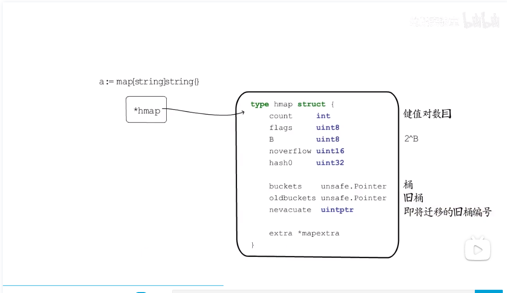
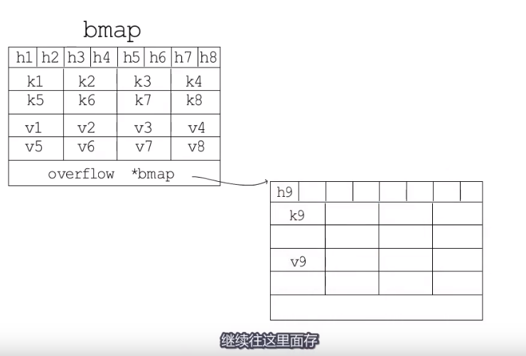

**map**

> **map构成**
>
> 将键值对进行哈希处理， 并使用一系列桶结构进行存储
>
> **hash哈希**
>
> 1. **哈希函数** 
>
>    > 方法一：取模法   hash%m(桶数量)
>    >
>    > 方法二：与运算   hash&(m-1), 其中m为2的整数次幂， 否则会导致某些桶永远不会被访问
>
> 2. **哈希冲突处理**  
>
>    > 开放地址法：不断向后寻找，直到找到某个空桶放入
>    >
>    > 拉链法： 冲突桶后悬挂一个新桶， 访问时首先访问冲突桶，若数值不一致，则访问冲突桶后的拉链
>
> 3. **负载因子**
>
>    > count/m 
>
> **桶的迁移**
>
> > 优先分配足够多的新桶，而后增加旧桶字段和迁移进度字段（下一个要迁移的旧桶编号），通过检测旧桶的迁移进度决定是否进行迁移工作，直到迁移工作全部完成旧桶不再使用，即完成一次哈希表扩容。
> >
> > 
>
> **哈希表的数据结构**
>
> >本质上是一个指针，指向hmap，hmap构成如下：
> >
> >
> >
> >bmap结构（map使用的桶）
> >
> >tophash介绍：https://blog.csdn.net/fengshenyun/article/details/97296412
> >
> >tophash是一个长度为8的数组，它不仅仅用来存放key的哈希高8位，在不同场景下它还可以标记迁移状态，bucket是否为空等。
> >
> >
> >
> >当哈希表分配的桶的数目大于2^4时，则认为使用溢出桶的概率较大， 会预分配2^(B-4)个桶备用（二者内存连续）。
> >
> >
>
> **map扩容规则**
>
> > go语言默认的负载因子：6.5
> >
> > count/(2^B) > 6.5 => 翻倍扩容
> >
> > 若负载因子没超标，但溢出桶过多 => 等量扩容 {
> >
> > ​	B <= 15 && noverflow >= 2^B
> >
> > ​    B > 15 && noverflow >= 2 ^15 
> >
> > } (主要处理删除大量键值对的桶)
> >
> > 

 