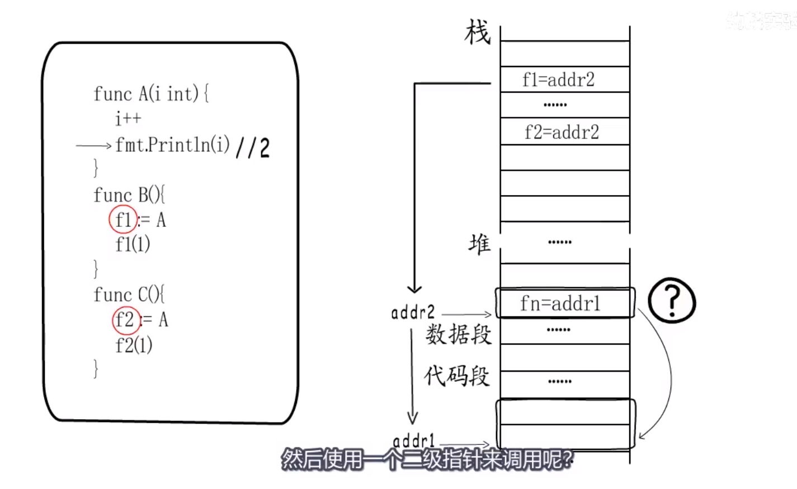

闭包

> **Function Value**
>
> Go中函数是头等对象。可以作为参数传递， 也可以作为函数返回值，也可以绑定变量。
>
> function value本质上是一个指针，指向一个runtime.funcval结构体，这个结构体里只有一个地址，即这个函数指令的入口地址。（原因：处理闭包的情况！！！）
>
> 
>
> 
>
> **闭包**
>
> //https://www.cnblogs.com/cxying93/p/6103375.html
>
> 两个要点：
>
> 1. 包含在函数外部定义但在函数内被引用的自由变量
> 2. 脱离捕捉时的上下文， 也能照常运行
>
> 闭包对象在执行时创建。
>
> 
>
> 
>
> 通过特殊寄存器保存的funcval地址与偏移量获取被捕获的变量
>
> 某种角度上，闭包就有含有捕获列表的funcval。
>
> 被捕获变量除赋值外未被修改， 直接拷贝值即可。
>
> **局部变量堆分配也是一种变量逃逸**
>
> 
>
> 被捕获变量为参数情况
>
> 
>
> 

